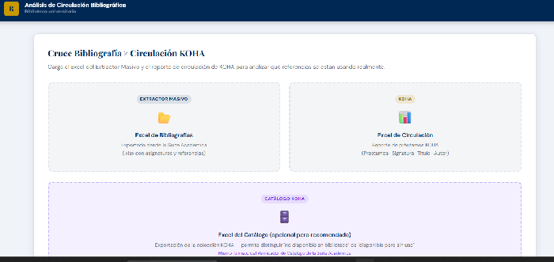
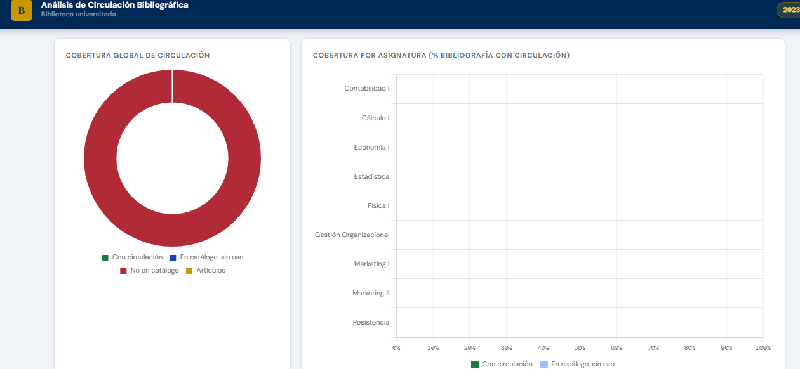

# 📊 circulacion-bibliografica

> Herramienta standalone para cruzar bibliografías de programas académicos con datos de circulación de KOHA — mide el uso real de la colección sin instalación ni servidor.

---

## ¿Qué problema resuelve?

Las bibliotecas universitarias asignan bibliografía en cientos de programas académicos, pero pocas pueden responder con datos concretos cuánto se usa realmente esa colección. Cruzar manualmente las listas bibliográficas con los registros de préstamo de KOHA es un proceso que toma días.

Esta herramienta lo hace en segundos.

---

## ¿Qué hace?

Carga tres archivos Excel y genera automáticamente un análisis completo de uso:

| Archivo de entrada | Contenido |
|---|---|
| **Extractor** | Referencias bibliográficas de los programas académicos |
| **Circulación KOHA** | Registros de préstamo exportados desde KOHA |
| **Catálogo** | Inventario completo de la colección |

Con esos tres archivos produce:

- **Cruce bibliografía × circulación** — identifica qué títulos asignados en los programas registran préstamos reales, cuáles no tienen uso y cuáles no están en el catálogo
- **Dashboard de indicadores** — tarjetas de resumen con totales, porcentajes de uso y títulos sin movimiento
- **Filtros dinámicos** — por período, carrera/programa y asignatura
- **Exportación Excel completa** — reporte detallado por título con todos los indicadores
- **Resumen por asignatura** — consolidado para reportes de gestión

---

## Demostración

### Vista general

### Dashboard de indicadores

---

## Cómo usar

No requiere instalación. Funciona completamente en el navegador.

1. Descarga el archivo `index.html` o accede a la versión en línea: **[[Ver demo](https://pablocana74.github.io/circulacion-bibliografica/)]**
2. Carga los tres archivos Excel en los paneles correspondientes
3. Completa el período y programa si corresponde
4. Revisa el dashboard y aplica los filtros que necesites
5. Exporta el reporte en Excel

---

## Formato de los archivos de entrada

### Extractor (bibliografías)

| Columna | Descripción |
|---|---|
| `titulo` | Título del recurso |
| `autor` | Autor(es) |
| `año` | Año de publicación |
| `asignatura` | Asignatura donde se usa |
| `carrera` | Carrera o programa académico |

### Circulación KOHA

Exportación estándar de préstamos desde KOHA. Las columnas mínimas requeridas son título, número de ítem y fecha de préstamo.

### Catálogo

Exportación del inventario desde KOHA o cualquier ILS con columnas de título, autor y número de ejemplares.

---

## Tecnologías utilizadas

- HTML5 + CSS3 + JavaScript vanilla (sin frameworks)
- [SheetJS](https://sheetjs.com/) para importación/exportación Excel
- [Chart.js](https://www.chartjs.org/) para visualizaciones del dashboard

Todo el procesamiento ocurre en el navegador. **Ningún dato sale del equipo.**

---

## Adaptar para otra institución

Esta herramienta fue desarrollada en una biblioteca universitaria chilena con KOHA como ILS, pero puede adaptarse a cualquier sistema que permita exportar datos de circulación en Excel.

Los únicos ajustes necesarios son:

1. **Nombre institucional** — encabezado HTML (líneas 10–20)
2. **Columnas del Excel de circulación** — función `mapCirculacion()` en el JS, según el formato de exportación de tu ILS
3. **Columnas del catálogo** — función `mapCatalogo()` en el JS

Si usas un ILS distinto a KOHA, el archivo de circulación puede venir con nombres de columna diferentes. Abre un [Issue](../../issues) describiendo tu formato y lo revisamos.

---

## Relación con otras herramientas

Este proyecto forma parte de un ecosistema de herramientas de gestión bibliográfica para bibliotecas universitarias:

| Herramienta | Audiencia | Descripción |
|---|---|---|
| [biblio-verifica](../biblio-verifica) | Bibliotecarios | Verificar referencias contra catálogo y cotizar adquisiciones |
| [apa-referencias](../apa-referencias) | Docentes · Secretarias | Crear y exportar bibliografías APA 7 |
| **Esta herramienta** | Bibliotecarios | Analizar uso real de la colección vs bibliografía asignada |

---

## Roadmap

- [ ] Soporte para exportaciones de circulación desde otros ILS (Alma, Millennium, Aleph)
- [ ] Comparación entre períodos académicos
- [ ] Indicador de títulos con alta demanda y bajo stock
- [ ] Gráficos de tendencia temporal de préstamos

---

## Autor

**Pablo Ocaña**
Profesional de biblioteca · Biblioteca universitaria
[pcocana@gmail.com](mailto:pablo.coronel@uniacc.edu) 

---

## Licencia

MIT — puedes usar, modificar y distribuir libremente con atribución.

